# Rapeseed Blender Models

An open-source digital plant model dataset representing different growth stages and morphological characteristics of rapeseed (*Brassica napus* L.).

## Overview

This project contains 200 Blender-based digital plant models of rapeseed covering multiple developmental stages.

The models were developed for rapeseed growth visualization, three-dimensional reconstruction, digital phenotyping, agricultural research, and educational applications.

Representative Cycles-rendered images are provided in this GitHub repository and organized according to the BBCH growth stage scale. The complete Blender model dataset will be released through Zenodo.
## Representative Images

### BBCH 10–19: Seedling and Leaf Development

  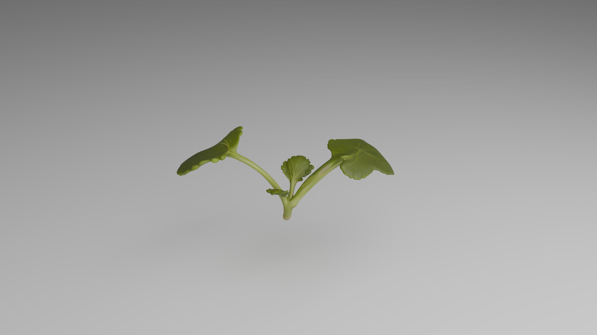
  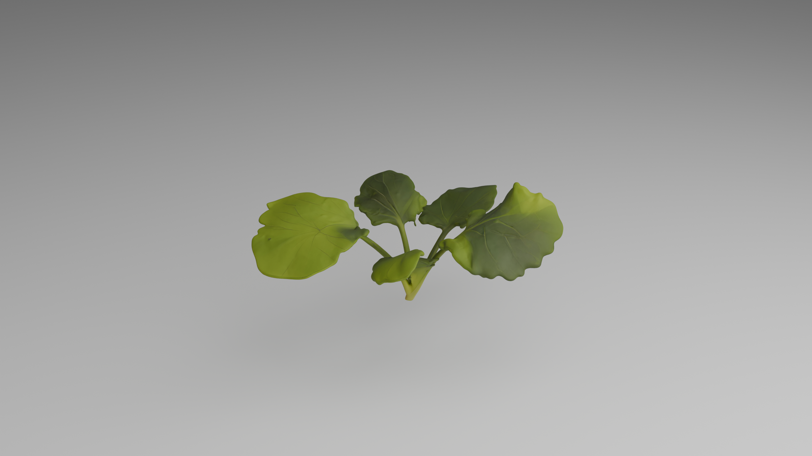

### BBCH 20–29: Rosette and Side Shoot Formation

  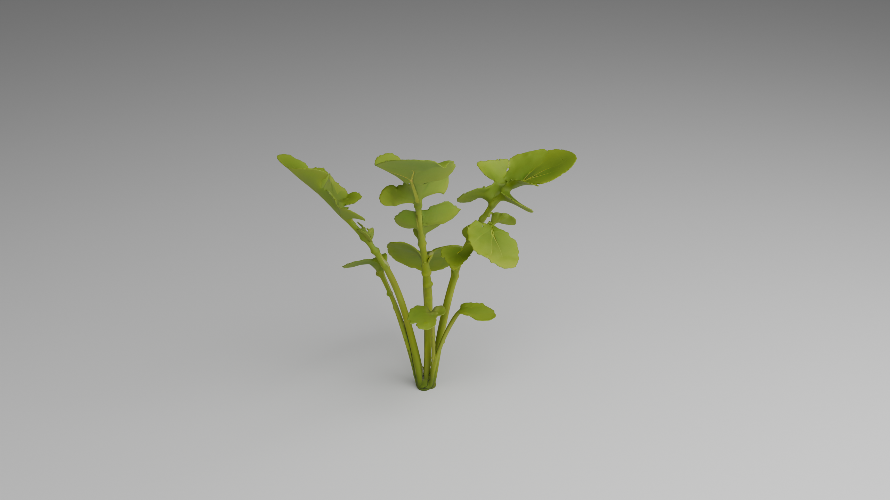
  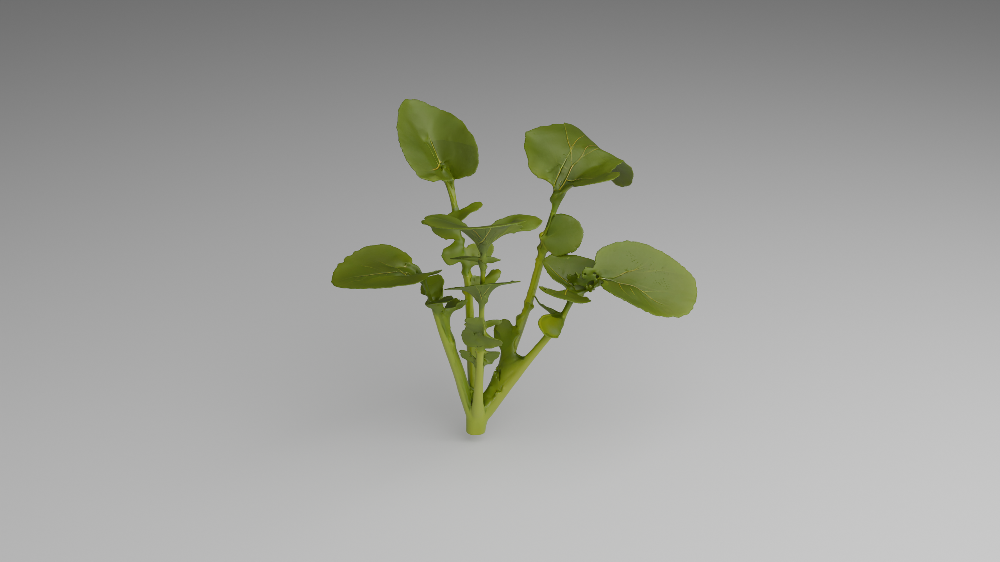

### BBCH 30–39: Stem Elongation

  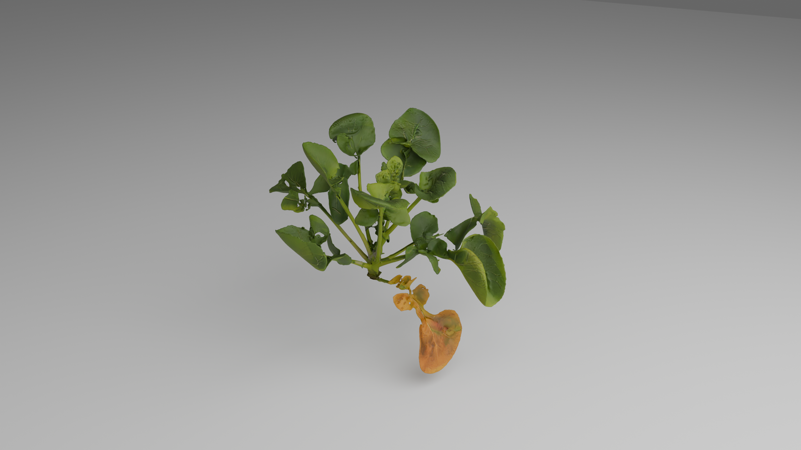
  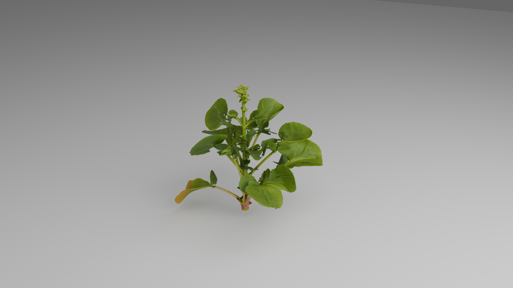

### BBCH 50–59: Bud and Inflorescence Development

  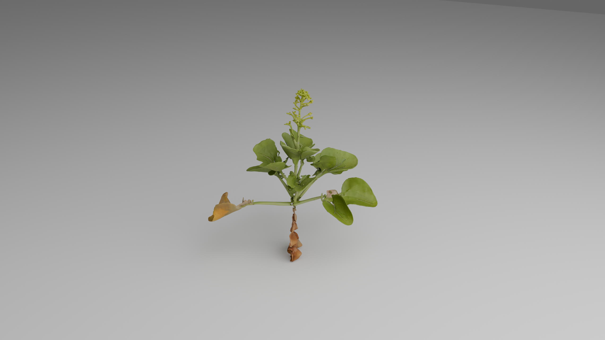
  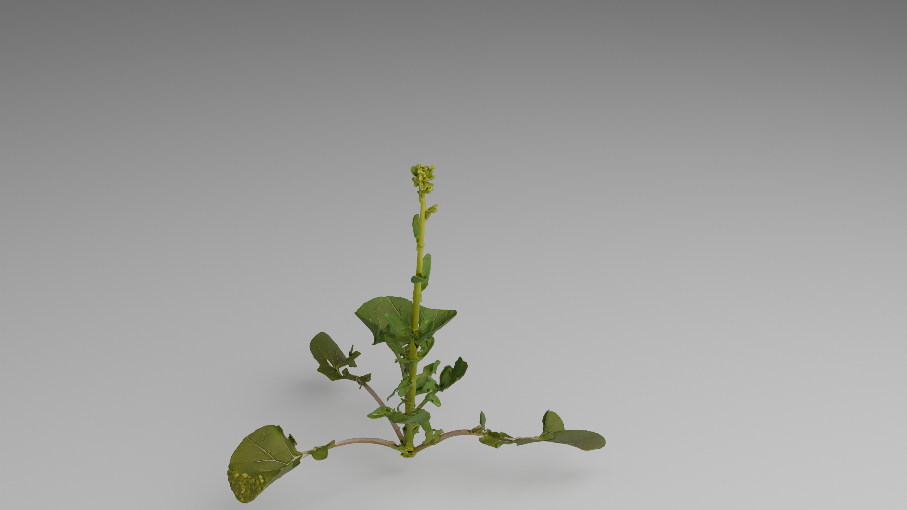

### BBCH 60–69: Flowering

  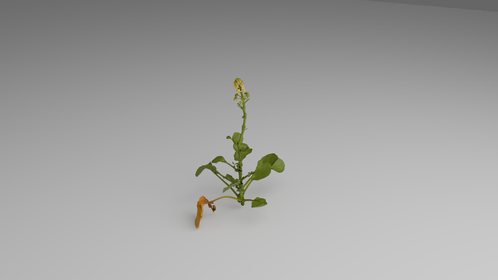
  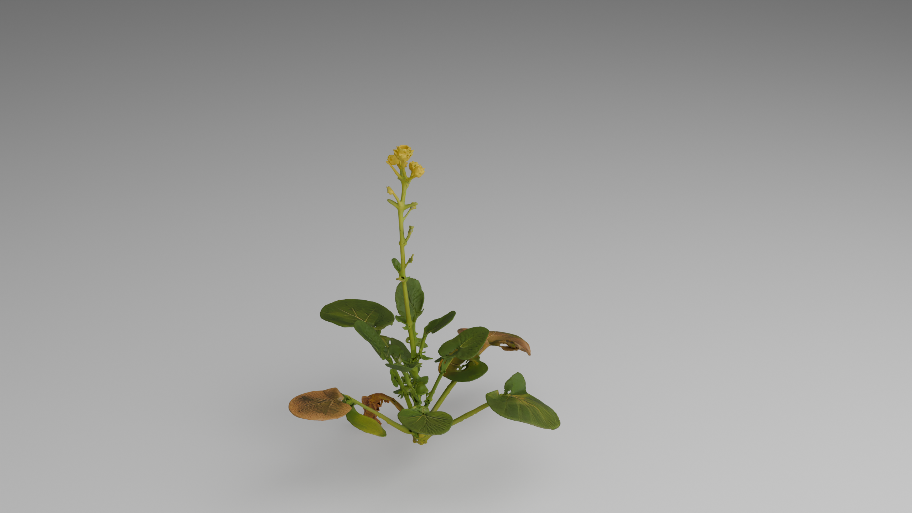

### BBCH 70–79: Pod Development

  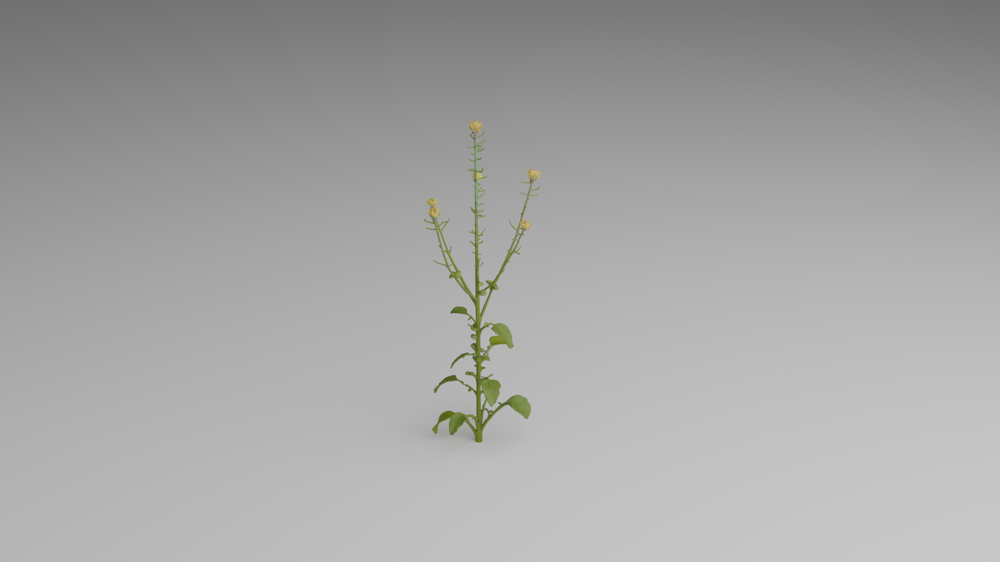
  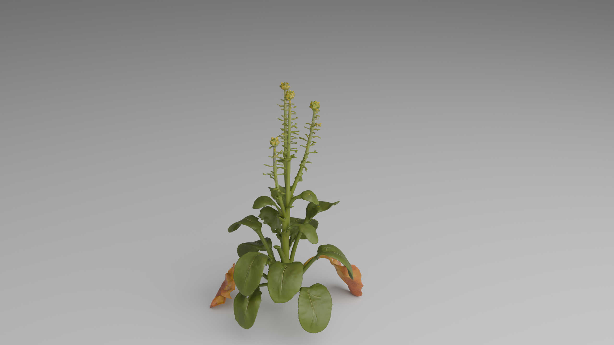

### BBCH 80–89: Ripening and Maturity

  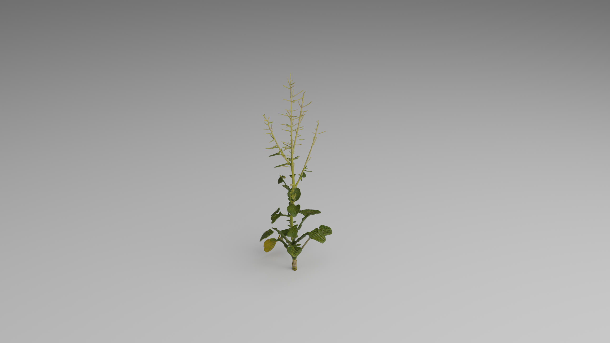
  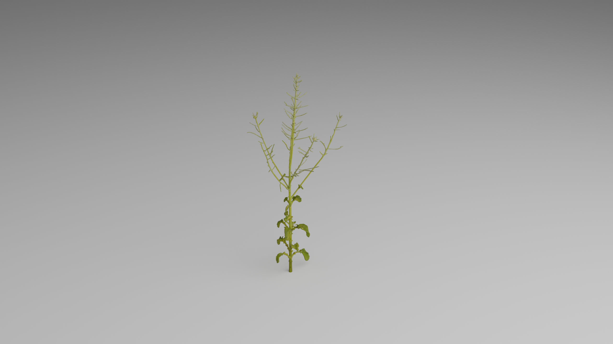

## Dataset Information

- **Species:** Rapeseed (*Brassica napus* L.)
- **Number of models:** 200
- **Model format:** Blender (.blend)
- **Software:** Blender 4.x
- **Rendering engine:** Cycles
- **Growth-stage classification:** BBCH scale
- **Data type:** Three-dimensional digital plant models

## BBCH Growth Stages

| Folder | BBCH range | Developmental stage |
|---|---|---|
| 01_BBCH10-19_Seedling | BBCH 10–19 | Seedling and leaf development |
| 02_BBCH20-29_Rosette | BBCH 20–29 | Rosette development |
| 03_BBCH30-39_Stem_elongation | BBCH 30–39 | Stem elongation |
| 04_BBCH50-59_Bud | BBCH 50–59 | Bud and inflorescence development |
| 05_BBCH60-69_Flowering | BBCH 60–69 | Flowering |
| 06_BBCH70-79_Pod | BBCH 70–79 | Pod development |
| 07_BBCH80-89_Maturity | BBCH 80–89 | Ripening and maturity |

## Model Characteristics

The digital plant models represent above-ground morphological structures, including:

- Leaf morphology
- Stem architecture
- Branching structure
- Bud and inflorescence characteristics
- Flowering characteristics
- Pod morphology
- Growth-stage-specific plant architecture
- Materials and rendering settings

## Repository Contents

This repository contains representative rendered images from the following stages:

- BBCH 10–19: Seedling stage
- BBCH 20–29: Rosette stage
- BBCH 30–39: Stem elongation stage
- BBCH 50–59: Bud development stage
- BBCH 60–69: Flowering stage
- BBCH 70–79: Pod development stage
- BBCH 80–89: Ripening and maturity stage

## Data Availability

This GitHub repository provides representative rendered images, BBCH growth-stage classification, and dataset documentation.

The complete dataset containing 200 Blender digital plant models is openly available through Zenodo.

- **Zenodo record:** https://doi.org/10.5281/zenodo.21740715
- **Version DOI:** 10.5281/zenodo.21740715
- **All-versions DOI:** 10.5281/zenodo.21740714

## Applications

This dataset may support:

- Digital plant modeling
- Three-dimensional crop visualization
- Plant phenotyping research
- Rapeseed growth-stage analysis
- Crop growth simulation
- Computer vision and agricultural artificial intelligence
- Agricultural teaching and scientific communication

## Citation

Please cite this dataset as:

Yuan, Y. (2026). *Rapeseed Blender Models: A Dataset of 200 Three-Dimensional Digital Plant Models Across Selected BBCH Growth Stages* (Version v1) [Data set]. Zenodo. https://doi.org/10.5281/zenodo.21740715

## License

This dataset is released under the Creative Commons Attribution 4.0 International License (CC BY 4.0).

Users may share and adapt the dataset, provided that appropriate credit is given to the author and the original dataset source.

## Author

**Yapeng Yuan**

Graduate Student  
College of Agronomy and Biotechnology  
Southwest University

## Research Background

This dataset was developed as part of a research project focusing on digital plant modeling and growth visualization of rapeseed (*Brassica napus* L.).

The project aims to construct digital representations of rapeseed plants at different developmental stages and provide model resources for agricultural visualization, digital phenotyping, and crop growth research.

## Contact

For questions or dataset-related discussions, please contact the author through GitHub Issues.

**Yapeng Yuan**  
College of Agronomy and Biotechnology  
Southwest University
